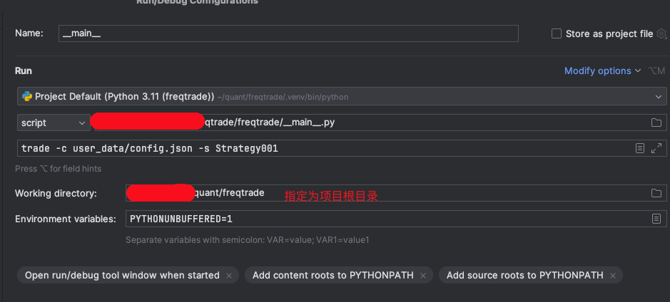

## 代码 安装

``` 
git clone https://github.com/freqtrade/freqtrade.git

cd freqtrade

git checkout stable

or

git checkout develop

```

### mac
[通过conda管理python环境](./anaconda.md)

### 下载 Freqtrade
```shell
# download freqtrade
git clone https://github.com/freqtrade/freqtrade.git

# enter downloaded directory 'freqtrade'
cd freqtrade  
```

### conda 创建环境
```shell
conda create --name freqtrade python=3.11
```
环境创建命令: `conda env create -n [name of the environment] [python version] [packages]`

进入环境
```shell
conda activate freqtrade
```

通过 pip 安装 python 依赖
```shell
python3 -m pip install --upgrade pip
python3 -m pip install -r requirements.txt
python3 -m pip install -e .

```
脚本安装相关依赖

`./setup.sh -i`

激活环境
`source ./.env/bin/activate`

解决 mac apple-silicon 错误：https://stackoverflow.com/questions/74566704/cannot-install-lightgbm-3-3-3-on-apple-silicon


### windows 

```
cd \path\freqtrade
python -m venv .env
.env\Scripts\activate.ps1
# optionally install ta-lib from wheel
# Eventually adjust the below filename to match the downloaded wheel
pip install --find-links build_helpers\ TA-Lib -U
pip install -r requirements.txt
pip install -e .
freqtrade

```

more: https://www.freqtrade.io/en/stable/installation/


运行
```
freqtrade trade -c config005.json --strategy Strategy005
```

## 测试

freqtrade 会默认去./user_data/strategies 目录中去找 类名为Strategy005的策略，不过config.json 需要指定路径

如果需要在代码中debug运行
1. 指定项目工作目录，这里使用项目根目录
2. 自定config.json位置和策略的类




