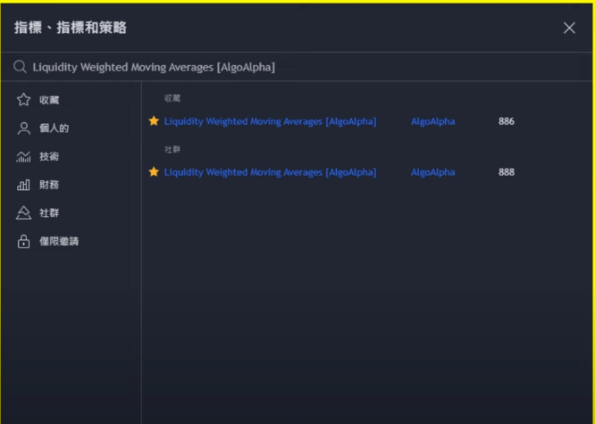
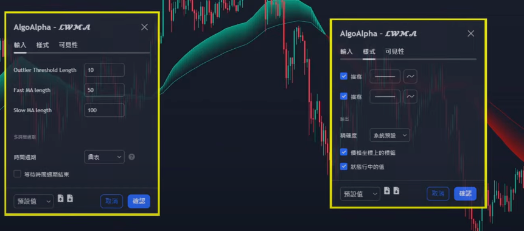
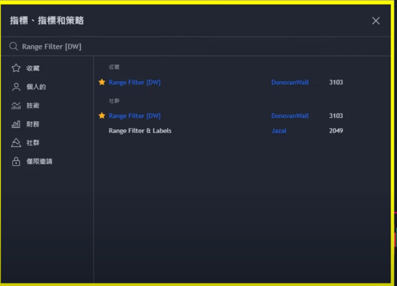
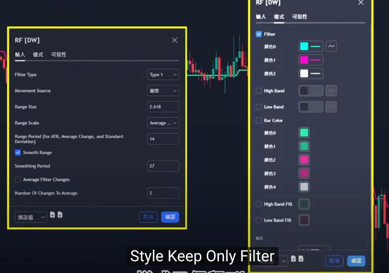
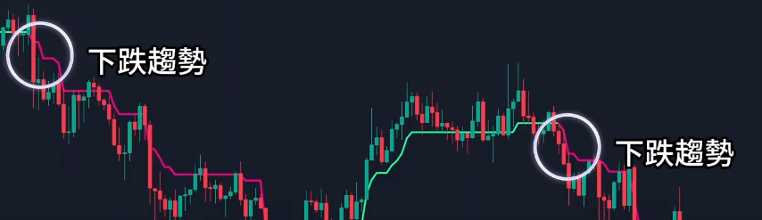
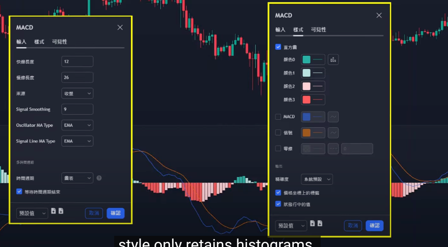
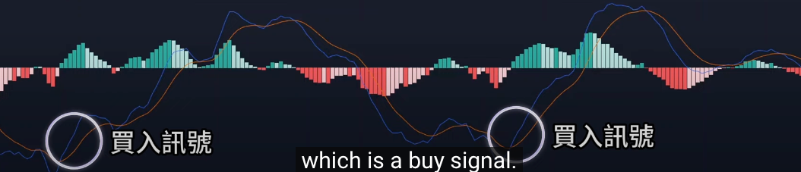
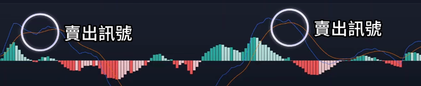
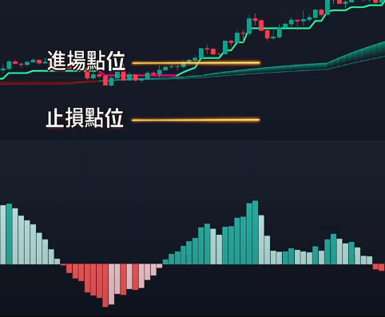
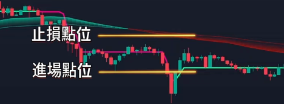

algoAipha流动性加权移动平均线策略

yutube视频链接：https://www.youtube.com/watch?v=X85pIfOKs_8

algoAipha 指标

透过查看流动性最高的蜡烛条来识别市场的潜在趋势。当MA快线上穿MA慢线形成绿色上升趋势，当MA快线下穿MA慢线形成红色下跌趋势

参数及样式：

第二个指标：Range Filter [DW]

类似超级趋势指标，当线为红色时做空，当线变为绿色时做多

参数及样式设置

 

第三个指标 MACD 平滑异同移动平均线

样式只保留直方图

利用收盘价的短期（常用为12日）指数移动平均线与长期（常用为26日）指数移动平均线

之间的聚合与分离状况，对买进、卖出时机做出研判的技术指标。

MACD 直方图由绿色转红，市场由多头转为空头，由红转绿，市场为空头转多头

买入信号：MACD线由下向上突破信号线

卖出信号：MACD由上向下突破MACD线，为卖出信号

多单规则：

1. algoalpha的加权移动平均线为绿色上升趋势
2. Range filter 指标的过滤下为绿色
3. MACD柱状图为绿色，或快线在慢线上方
4. 止损设置在K线下方的摆动低点，获利设置为1:2的盈亏比

空单规则：

1. algoalpha的加权移动平均线为红色下降趋势
2. Range filter 指标的过滤下为红色
3. MACD柱状图为红色，或快线在慢线下方
4. 止损设置在K线下方的摆动高点，获利设置为1:2的盈亏比

