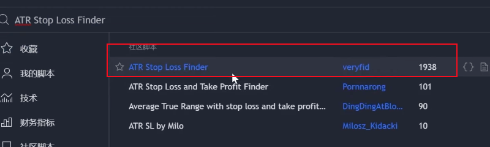

5m 剥头皮策略 Nadaraya-Watson Envelop + ATR Stop Loss + RSI

## Nadaraya-Watson Envelo
Nadaraya-Watson Envelo 策略， 作者：LuxAlgo

### 指标设置：

样式取消标签和Tables

输入保持默认值

## ATR Stop Loss Finder 
ATR Stop Loss Finder 指标，作者：veryfid

输入设置：

长度14， 平滑RMA，多元0.5 其他保持默认

样式设置：
去掉 Tables 标签

## RSI

输入设置：

天数长度：5

样式设置：

取消 RSI-based MA，取消 RSI Middle Band

## 交易策略

### 做多

1. 阴线在NWE之后表红线下方收盘；
2. RSI位于超卖区下方

**关键K线：** 一个在NWE指标红线上方收盘的阳线。

止损：ATR 止损指标下线

止赢：参考1:1.5 盈亏比的位置

### 做空

1. 阴线在NWE指标绿色上方收盘
2. RSI位于超买区上方

**关键K线：** 一个在NWE指标绿色下方收盘的阴线

**止损：** ATR止损指标上线

**止赢：** 参考1:1.5 盈亏比的位置

